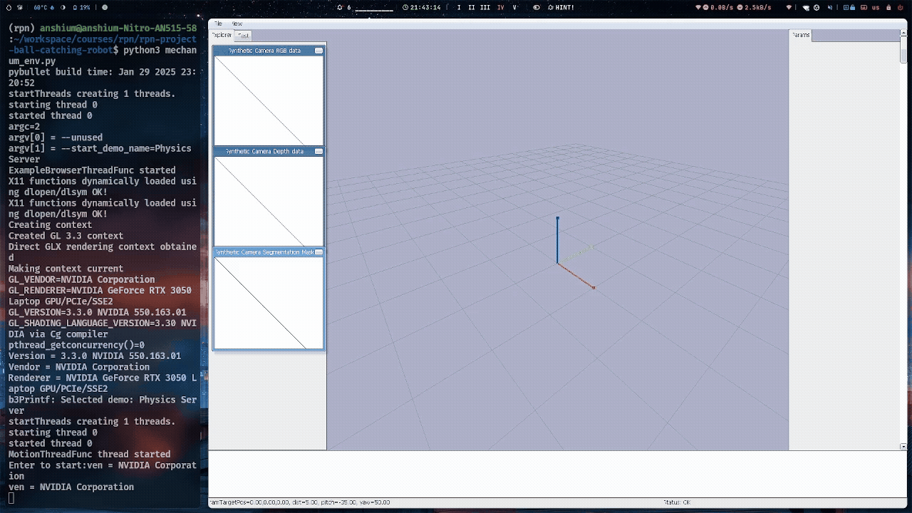

# Autonomous Ball Interception with Mecanum Robot (MPC)

[](https://www.python.org/)
[](https://pybullet.org/)
[](https://opensource.org/licenses/MIT)

A robotics simulation project demonstrating high-speed projectile interception using an omni-directional (Mecanum) mobile base. This system integrates real-time physics prediction, Model Predictive Control (MPC), and dynamic obstacle avoidance.

---

## Project Overview



The core challenge of this project is to bridge the gap between **prediction** and **execution**. While the physics of a falling ball are predictable, navigating a robot to the exact interception point in a crowded environment requires sophisticated control strategies.

### Key Capabilities
*   **Predictive Interception**: Calculates the exact landing $(x, y)$ coordinate and time-to-impact before the ball reaches its peak.
*   **Omni-directional Motion**: Utilizes Mecanum wheels to move in any direction (strafing, diagonal, rotation) instantly without changing heading.
*   **MPC Navigation**: Uses specialized optimization (CVXOPT) to generate local paths that respect velocity limits and avoid collisions.
*   **Dynamic Environments**: Successfully navigates around static obstacles while pursuing the moving target.

---

## System Architecture

### 1. The Predictor (`ball.py`)
Matches the PyBullet gravity model to solve the parabolic motion equation. It identifies the future impact point on the ground plane ($z=0$):
$$z(t) = z_0 + v_{z0}t + \frac{1}{2}g t^2 = 0$$

### 2. The Pilot (`mpc_controller.py`)
Instead of simple PID, we use **Model Predictive Control**. At every 100ms, the robot:
1.  Looks ahead 20 steps (2 seconds) into the future.
2.  Solves a Quadratic Programming (QP) problem to find the smoothest velocities.
3.  Ensures the robot never steps within the "danger zone" of an obstacle.


### 3. The Environment (`mechanum_env.py`)
Hardware-abstracted interface for the robot, managing PyBullet sensors, motor commands, and simulation stepping.

---

## Installation

1.  **Clone the repository**:
    ```bash
    git clone https://github.com/your-username/rpn-project-ball-catching-robot.git
    cd rpn-project-ball-catching-robot
    ```

2.  **Install dependencies**:
    ```bash
    pip install numpy pybullet cvxopt matplotlib
    ```

---

## Running the Simulation

To launch the full interception demo:
```bash
python mechanum_env.py
```

### Controls & Visualization
*   **Green Sphere**: The predicted landing zone.
*   **Red Spheres**: Obstacles to be avoided.
*   **Red Dotted Line**: The robot's real-time planned path (MPC horizon).

---

## Repository Structure

| File | Description |
| :--- | :--- |
| `mechanum_env.py` | Main entry point; manages the robotic simulation loop. |
| `ball.py` | Projectile math and ball spawning logic. |
| `mpc_controller.py` | The optimization engine for navigation. |
| `mechanum_robot_spawn.py`| Helper utility for URDF loading. |
| `description/` | Contains URDF and visual meshes for the robot. |
| `main.ipynb` | Prototyping notebook for MPC cost functions and collision logic. |

---

## Future Roadmap
- [ ] **Visual Servoing**: Replace "perfect knowledge" of ball velocity with a simulated RGB-D camera feed.
- [ ] **ROS2 Integration**: Export the controller as a ROS2 node for deployment on physical hardware.
- [ ] **Multi-Agent Coordination**: Intercepting multiple projectiles with a swarm of robots.

---

## Contributing
Contributions are welcome! Please open an issue or submit a pull request if you have ideas for improving the MPC solver or adding more complex intercept scenarios.

## License
Distributed under the MIT License. See `LICENSE` for more information.
